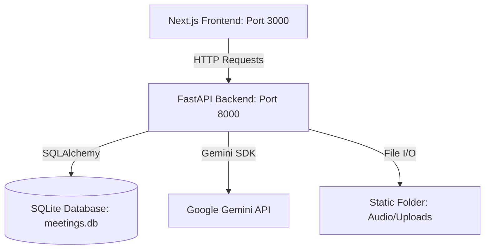
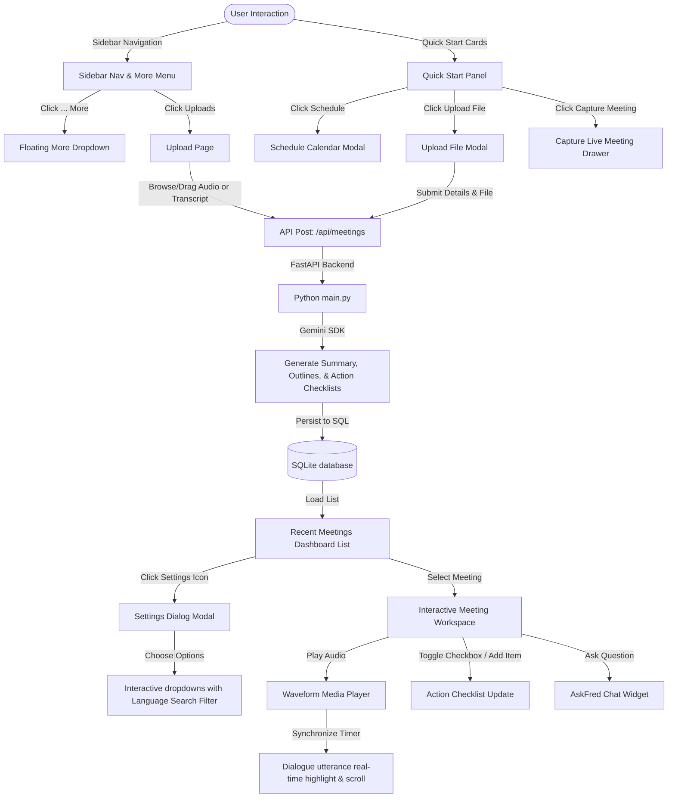

# Fireflies.ai Clone - Meeting Notes & Transcription Platform

A fullstack web application clone of Fireflies.ai replicating its modern design, layout aesthetics, and core post-meeting workflows.

---

## 🛠 Tech Stack

The application is built using a modern, lightweight, and robust stack:

### Frontend
* **Next.js 14+ (App Router)**: Offers server-side rendering, client-side routing, and file-based organization.
* **TypeScript**: Provides type safety and interface definitions.
* **Tailwind CSS**: Used for rich, responsive, utility-first styling.
* **Lucide React**: Provides clean vector-based line icons.
* **React Player**: Handles video modal overlays and bezels.

### Backend
* **Python FastAPI**: A high-performance, developer-friendly web framework for building APIs.
* **SQLAlchemy**: Python SQL toolkit and Object Relational Mapper (ORM) used to map database tables to SQLite database.
* **SQLite**: A lightweight, disk-based database requiring zero setup.
* **Google Gemini API**: Integrated via `google-generativeai` SDK to automatically summarize transcripts, outline meetings, extract action checklist points, and power the AskFred AI assistant chat widget.

---

## 📊 Application Architecture

---

## 🔄 Diagrammatic Workflow

The following flowchart details the user interaction paths, component triggers, and client-server communication flows inside the application:

---

## 📖 Simple Workflow Explanation

1. **User Navigation**: The user navigates the dashboard using the sidebar links or the interactive floating **... More** pop-out menu.
2. **Action Entry Points**: From the home panel, users can trigger Quick Start actions (Schedule meetings, Upload file transcriptions, or Capture live conference feeds).
3. **Data Ingestion**: When uploading files or pasting text dialogue transcripts, Next.js calls FastAPI's backend endpoints.
4. **AI Generation**: The backend triggers Google's Gemini LLM to analyze the meeting, automatically building outline chapters, checklists, and summary text.
5. **Interactive Logs**: Seeded and newly created meetings display on the main dashboard tab list. Users can toggle settings options (with language search filters).
6. **Workspace Details**: Selecting a meeting opens the detailed log viewer containing waveform controls, utterance highlights synced to audio playback, and the AskFred LLM assistant chat panel.
